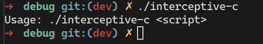

# interceptive-c


interceptive-c is a work in progress progamming language, written in Rust. It is inspired by the syntax of Go, Kotlin and Rust itself. However, many fundamentals from these languages are not copied over; primarily the syntax.


# Usage
To use the program, run the compiled executable. Currently, there are no pre-built compiled executables provided; it is in development, after-all.
For example:
```sh
./interceptive-c
```
or on Windows:
```pwsh
./interceptive-c.exe
```
You can also run the program directly, in debug mode:
```sh
cargo run <file>
```

# Compiling
To compile, use Cargo:
```sh
cargo build
```
This will automatically handle everything for you.
